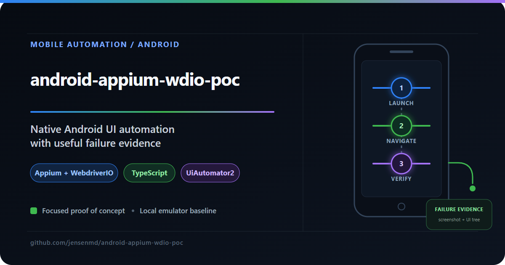
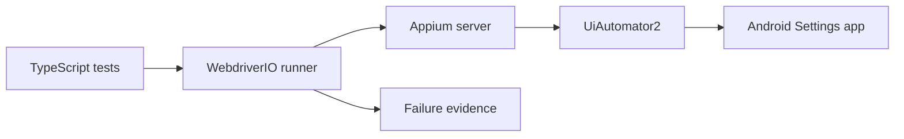

# Android Appium + WebdriverIO POC



A deliberately small native Android automation proof of concept built with Appium, WebdriverIO, TypeScript, Mocha, and UiAutomator2 on Windows 11.

[](https://github.com/jensenmd/android-appium-wdio-poc/actions/workflows/validate.yml)

## Scope

This project demonstrates a local emulator baseline:

- Opens Android's built-in Settings app through Appium and UiAutomator2.
- Checks the Settings home screen, forward navigation, and back navigation.
- Saves a screenshot and Android UI hierarchy when a test fails.
- Type-checks the WebdriverIO configuration and test suite in CI.

Using the built-in Settings app keeps the repository self-contained; no sample APK is required. This is a learning POC, not evidence of production framework ownership, real-device coverage, device-cloud execution, or cross-version compatibility.



## Verified environment

The full three-test suite was run locally on August 28, 2026 with:

- Windows 11
- Node.js 24.14.0 and npm 11.9.0
- Eclipse Temurin JDK 17.0.20.1
- Appium 3.7.x and UiAutomator2 8.5.x
- Android 15 / API 35 Medium Phone emulator

See [the verified-run record](docs/verified-run.md) for the result and a sanitized excerpt of the failure evidence used during debugging.

## Prerequisites

- Node.js 24 and npm
- Git
- Java JDK 17 or newer
- Android Studio, an Android SDK, and an Android emulator
- `JAVA_HOME` and `ANDROID_HOME` configured
- Android SDK `platform-tools` and `emulator` directories on `PATH`

In PowerShell, verify the environment before installing dependencies:

```powershell
node --version
npm --version
java -version
adb version
emulator -version
```

If `adb` or `emulator` is not found, add these directories to `PATH`, substituting your SDK location if necessary:

```text
%LOCALAPPDATA%\Android\Sdk\platform-tools
%LOCALAPPDATA%\Android\Sdk\emulator
```

## Install

```powershell
npm ci
npx appium driver doctor uiautomator2
```

The UiAutomator2 driver is pinned as a development dependency. The doctor command verifies its external Android and Java requirements.

Create and boot an Android virtual device in Android Studio's Device Manager. Confirm that exactly the intended target is available:

```powershell
adb devices -l
```

## Run

Start Appium in one PowerShell window:

```powershell
npm run appium
```

In a second window:

```powershell
npm run check
npm run test:smoke
npm test
```

The smoke test verifies that Appium has opened the Settings home screen. It is not a cold-launch, installation, or application-lifecycle test.

To override the default local device label:

```powershell
$env:ANDROID_DEVICE_NAME = "Your emulator name"
npm test
```

This override is convenient locally, but device-cloud execution would also require provider authentication, remote connection settings, and provider-specific capabilities.

## Failure evidence

Failed tests attempt to save both a timestamped screenshot (`.png`) and Android UI hierarchy (`.xml`) under `artifacts/`. Runtime artifacts are ignored because they may be large, device-specific, or contain incidental device information. Only reviewed and sanitized evidence belongs in `docs/`.

## Test design

- `maxInstances: 1` keeps the single-emulator baseline sequential.
- A pre-test hook reopens Settings and backs out of a restored subpage before each check.
- Text selectors keep this POC readable but make it dependent on English labels and Android Settings UI details.
- Product-owned mobile tests should prefer stable accessibility identifiers or resource IDs when available.

## Current limitations

- One local Android 15 emulator only
- Android Settings rather than a product APK
- No real-device, device-cloud, iOS, parallel, install, or lifecycle coverage
- English and Android-version-dependent selectors
- A pragmatic bounded back-navigation reset rather than app-data isolation
- CI validates locked installation and TypeScript only; emulator tests remain local

## Dependency status

Checked August 28, 2026: `npm audit --omit=dev` reported zero production vulnerabilities. The complete development tree reported 15 advisories (1 moderate and 14 high) in transitive test tooling. Automated forced fixes were not applied because npm proposed breaking WebdriverIO changes; upgrades should be evaluated and the emulator suite rerun.

## Engineering notes

[Engineering notes](ENGINEERING_NOTES.md) explain the decisions, observed failures, and limits without presenting this POC as production experience.


---

## QA Portfolio Quick Reference

This project is part of a broader QA portfolio demonstrating complementary quality-engineering skills.

| Project | Focus |
|---|---|
| [android-appium-wdio-poc](https://github.com/jensenmd/android-appium-wdio-poc) **(this repository)** | Native Android UI automation proof of concept using Appium, WebdriverIO, TypeScript, and UiAutomator2 |
| [mapmyrun-quality-investigation](https://github.com/jensenmd/mapmyrun-quality-investigation) | Black-box mobile and GPS quality investigation using field evidence and bounded conclusions |
| [restful-booker-qa](https://github.com/jensenmd/restful-booker-qa) | Layered API and UI automation using Postman, Newman, Playwright, and GitHub Actions |
| [pharmacy-spend-etl-qa](https://github.com/jensenmd/pharmacy-spend-etl-qa) | ETL pipeline and SQL-driven data-integrity validation modeled after healthcare analytics work |
| [qa-automation-showcase](https://github.com/jensenmd/qa-automation-showcase) | REST API testing, data validation, and CI/CD-integrated automation |
| [ai-qa-framework](https://github.com/jensenmd/ai-qa-framework) | Human-reviewed AI-assisted test generation with structured cases and pytest execution |
| [claude-code-qa-sessions](https://github.com/jensenmd/claude-code-qa-sessions) | Agentic analysis of existing QA repositories with human review and targeted implementation |
| [agentqa-orchestrator](https://github.com/jensenmd/agentqa-orchestrator) | Structured agentic code auditing using Python, Pydantic, Gemini, and JSON |

## License

MIT

